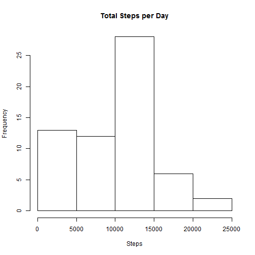
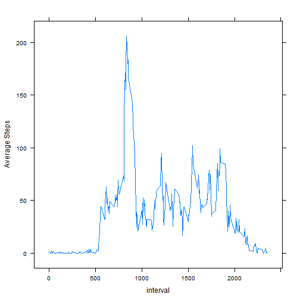
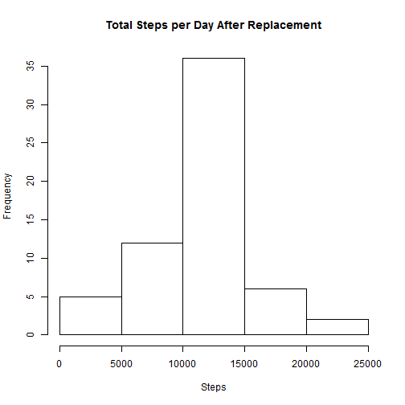
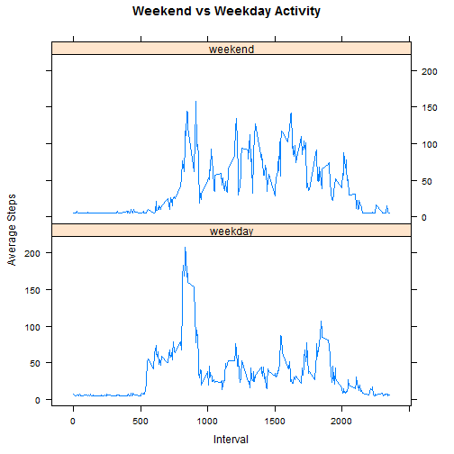

Reproducible Results - Peer Assessment 1
========================================

## Loading and Pre-processing Data
Zipped file containing all data is included in the Github load, so just unzip and create data frame.


```r
unzip("activity.zip")
activity = read.csv("activity.csv")
```

## What is mean total number of steps taken per day?


```r
library(data.table)
dt = data.table(activity)
daily = dt[,list(total_steps=sum(steps, na.rm=T)),by=date]
hist(daily$total_steps, main="Total Steps per Day", xlab="Steps")
```

 

```r
mean=mean(daily$total_steps)
median=median(daily$total_steps)
```

The mean number of steps is 9354.2295082 and the median is 10395.

## What is the average daily activity pattern?

Compute average steps by 5-minute interval.


```r
library(lattice)
period = dt[,list(avg_steps=mean(steps, na.rm=T)), by=interval]
xyplot(avg_steps~interval, data=period, type="l", ylab="Average Steps")
```

 

```r
max_steps = max(period$avg_steps)
max_row = which.max(period$avg_steps)
```
The maximum average steps per interval is 206.1698113, found at row 104.

## Imputing missing values


```r
na_count =  sum(is.na(activity$steps))
```

We can determine how many rows have missing values with the "is.na" function. Note that the instructions were a little fuzzy on this one.  The code below counts the missing steps field.  To get all NAs, including date and interval fields (if any), we could use "sum(is.na(activity))".


Before replacement, the data frame has 2304 NAs.

Next, we create a new data frame and replace NAs with the average steps for all periods.


```r
replaced = activity
replaced[is.na(replaced[, "steps"]), "steps"] <- mean(replaced[, "steps"],  na.rm = TRUE)
na_count = sum(is.na(replaced$steps))
```
After replacement, the new data frame has 0 NAs.  We can see how the replacement affected the distribution below:


```r
dtR = data.table(replaced)
dailyR = dtR[,list(total_steps=sum(steps, na.rm=T)),by=date]
hist(dailyR$total_steps, main="Total Steps per Day After Replacement", xlab="Steps")
```

 

```r
meanR=mean(dailyR$total_steps)
medianR=median(daily$total_steps)
meanV = meanR - mean
medianV = medianR - median
```

The new mean number of steps is 10766.19, a change of 1411.959; the new median is 10395, a change of 0.

## Are there differences in activity patterns between weekdays and weekends?

First, add a column to the data table to indicate whether the date in in the weekend or not, then plot each series:


```r
dtR$day = as.factor(ifelse( weekdays(as.Date(dtR$date)) %in% c('Saturday','Sunday'), "weekend", "weekday" ))
period = dtR[,list(avg_steps=mean(steps, na.rm=T)), by=c("day","interval")]
xyplot(avg_steps~interval | day, data=period, type="l", main="Weekend vs Weekday Activity", xlab="Interval", ylab="Average Steps", layout=c(1,2))
```

 
